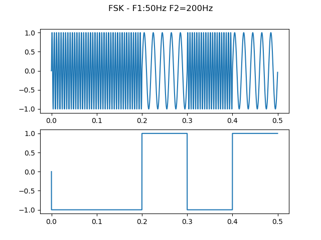

# Projeto final de EE881
## Modulação digital FSK
Até agora, nós vimos apenas modulações digitais em amplitude. Para o projeto nós vamos utilizar outra estratégia de modulação, onde a informação está contida na frequência da portadora. Para o modem acustico, essa estratégia é eficiente, pois como vimos em transmissões analógicas, modulações em frequência apresentam uma imunidade ao ruído muito superior a transmissões em amplitude. 
A modulação FSK (*frequency-shift keying*) consiste em uma modulação em banda passante onde a informação é enviada por meio de mudanças discretas na frequência de uma portadora. O modo mais simples de gerar esse tipo de modulação é "chavear" a frequência da portadora entre dois valores conforme o bit a ser transmitido é zero ou um. Essa portadora então é multiplicada pelo pulso de transmissão adotado e enviada. 
Esta modulação normalmente é adotada em transmissões na banda de RF, no entanto ela permite utilizarmos frequências baixas para a portadora com uma perda tolerável de eficiência. Essa capacidade faz com que seja possível uma transmissão digital por canais normalmente utilizados para transmitir voz (telefone, rádio-difusão, alto-falantes, etc) e fornece um protocolo versátil de comunicação onde não há possibilidade de se transmitir por ondas de rádio ou fibra óptica. 

## Sincronismo
A mensagem a ser transimitida é assíncrona, ou seja, não há uma combinação prévia do horário em que ela será transmitida, então o detector desenvolvido deverá ser capaz de identificar corretamente o início e o fim de cada transmissão de dados. Para isso toda mensagem se iniciará com uma sequência pré-definida de bits. O cabeçaho não entra na conta da taxa de erro, então não é necessário que o decodificador o identifique totalmente, mas é fundamental que o momento da transição entre o cabeçalho e a mensagem seja definido com precisão. O cabeçalho utilizado se encontra no arquivo *header.txt*. Essa sequência foi gerada utilizando um algoritmo chamado "*maximum length sequence*" e aumenta a resolução do pico de auto-correlação, facilitando a identificação do cabeçalho.

## Formato dos dados
Os dados transmitidos podem ser de diferentes fontes (áudio, texto, imagem, etc), e de tamanhos variados. O detector deve ser capaz de receber os bits e fornecer **sem o cabeçalho** para a função *app_decoder* fornecida neste repositório (app_decoder.m ou app_decoder.py, a depender da linguagem escolhida). A função retorna a quantidade de bits perdidos no processo de detecção. É especialmente crítico que o momento to início da mensagem seja identificado corretamente, pois um erro de sincronismo levará ao erro de grande parte dos bits da mensagem e consequentemente ao fracasso da transmissão. 

## Constelação de sinais adotada

Serão testadas duas modulações diferentes. Uma 2-FSK e uma 4-FSK. O detector deverá permitir escolher uma das duas modulações no momento de iniciar a transmissão. O protocolo de transmissão será o seguinte:

- 2-FSK
    - 800 Hz - 0
    - 1200 Hz - 1

- 4-FSK
    - 600 Hz - 00
    - 800 Hz - 01
    - 1000 Hz - 11
    - 1200 Hz - 10

Não há restrições quanto à estratégia de detecção, apesar de ser recomendado o emprego de um filtro casado. Para quem tiver curiosidade, as funções que fazem a transmissão se encontram no arquivo TX_script.py.

## Taxa de símbolos
A taxa de síbolos utilizada será definida no momento da transmissão. O detector deverá fornecer a opção de definir a taxa ao início do processo de decodificação.

## Arquivo de teste
No repositório, encontram-se dois arquivos de teste: *teste_2fsk.wav* e *teste_4fsk.wav*. Estes arquivos foram gerados com uma taxa de 30 símbolos por segundo e podem ser utilizados para auxiliar o desenvolvimento do projeto. Os arquivos *teste_2fsk.txt* e *teste_4fsk.txt* contém as respectivas sequências de bits. A função fornecida também identifica os áudios de teste e fornece o numero de bits incorretos. Eles são os arquivos gerados, sem ruído, para testar a imunidade ao ruído vocês podem utilizar o microfone e gravar uma reprodução dos áudios.

## Entrega
A entrega do trabalho será dia 26/11 e consistirá no teste ao vivo do decodificador. Uma sequência de transmissões será feita utilizando o sistema de som de uma das salas da FEEC (a definir) e o sucesso será medido (não exclusivamente) pela capacidade do modem de decodificar corretamente as sequências de bits enviadas. Para os grupos que apresentaram dia 26 e desejarem corrigir possíveis problemas uma segunda apresentação poderá ser agendada para dia 28/11. O código do modem deverá ser submetido no moodle até o encerramento do semestre no dia 30/11.

